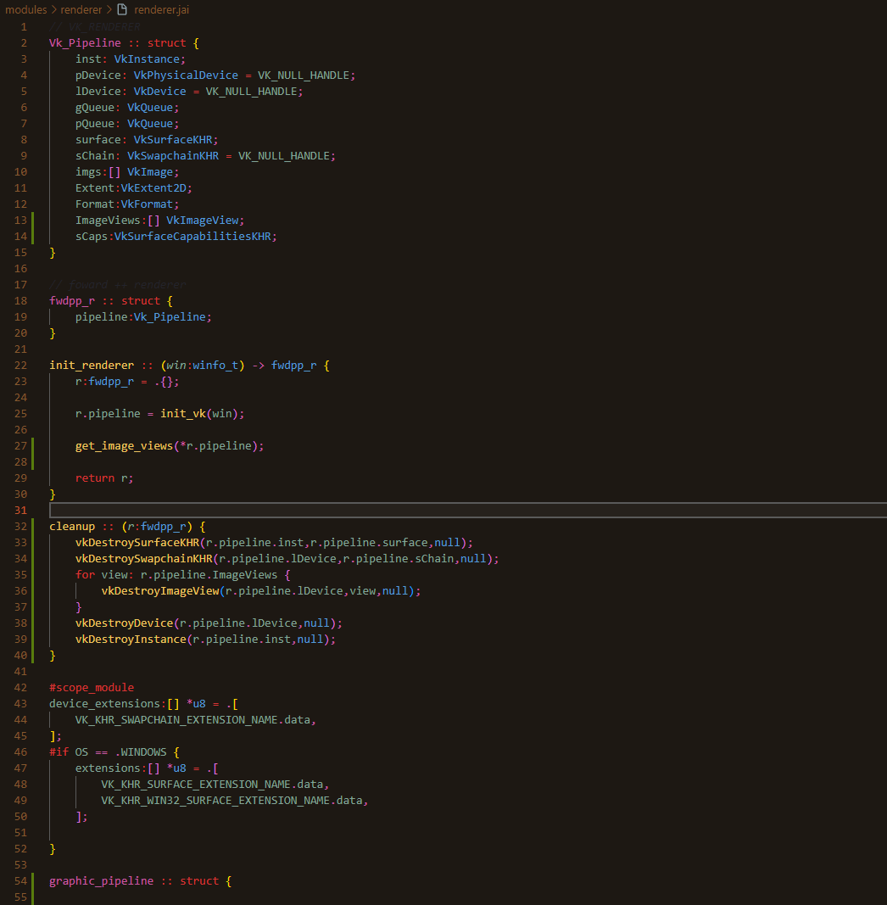
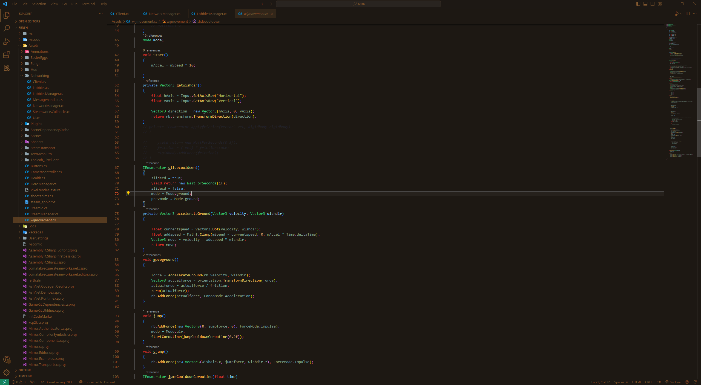

# Espresso theme  
A light elegant gruvbox flavored coffee




I made this because no one makes good coffee themes! Other than Owlet but I was dissatisfied with the syntax colors chosen for Owlet's Espresso theme.

## Building

```sh
$ vsce package
```
from there go into vscode, extensions -> 3 dots -> install from vsix

I don't publish this because I do not want to unironically use azure 💀
